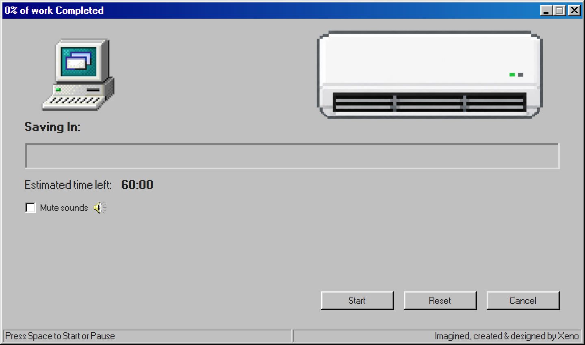
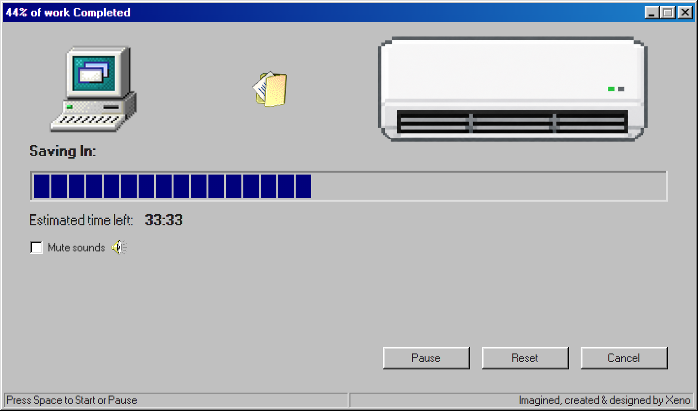
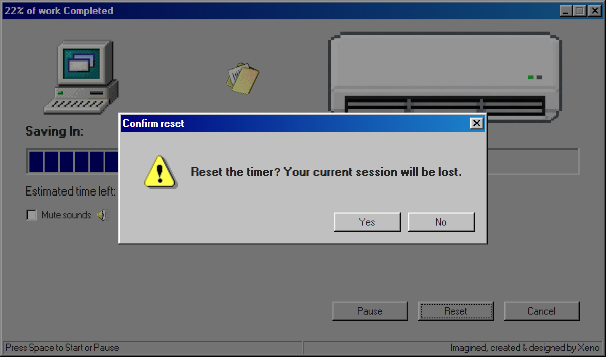
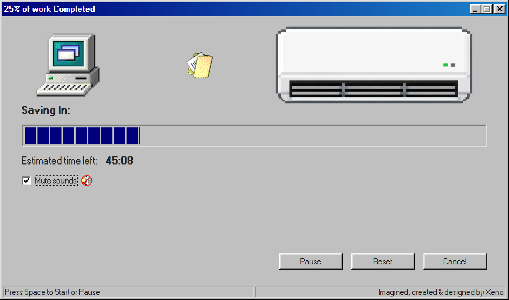
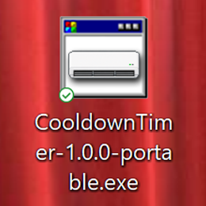

# Cooldown Timer

A Windows 98-themed productivity timer that enforces breaks — because breaks aren't optional, they're how you sustain focus.



## About

Cooldown Timer is a desktop app for structured focus sessions. It runs a fixed cycle: 60 minutes of work, 15 minutes of break, repeat. Every fourth break is a 30-minute long break. There is no "skip" button — the timer enforces the rhythm because the discipline is the point.

The app is themed after Windows 98's classic file-copy dialog. Your focus session is "saving in" while a folder icon animates from the computer to an air conditioner, doing barrel rolls in flight. Each phase transition plays a different authentic Windows 98 system sound. When paused, the folder freezes mid-air. The metaphor is the message: work is being saved when you're focused; nothing is saved when you're not.

This was built as a learning project to deepen my React, Electron, and Node.js skills while shipping a real desktop application end-to-end — from architectural design through styling, packaging and distribution as a portable Windows executable.

## Features

- **Drift-free countdown timer** using endTime arithmetic against the system clock (rather than naive decrement)
- **Three-phase state machine**: work (60 min) → short break (15 min) → repeat, with every fourth break extended to 30 min
- **Frameless Windows 98-style window** with custom title bar, draggable region, and IPC-driven minimize/close controls
- **Live progress bar and percentage** synchronized to timer state
- **Phase-specific audio cues** using authentic Windows 98 system sounds (work/short break/long break each have distinct sounds)
- **Mute toggle** with state-aware speaker icon (on/off variants)
- **Animated folder graphic** that travels from computer to AC while "saving" is in progress, with barrel-roll rotation; pauses with the timer
- **Confirmation modals** for destructive actions (Reset and Cancel)
- **Keyboard shortcuts** (Space to start/pause, Escape to dismiss modals)
- **Dynamic window title** showing live countdown for visibility from the taskbar

## Tech Stack

- **Electron 42** — desktop runtime
- **React 19** with hooks (useState, useEffect)
- **Vite 8** — build tool and dev server
- **98.css** — Windows 98 component styling
- **electron-builder** — packaging to portable Windows .exe
- **CSS Modules** — scoped component styling

The project uses ES modules throughout the renderer, with the Electron main process using CommonJS (a deliberate split — see `electron/main.cjs` and `electron/preload.cjs`).

## Screenshots

| Work in progress | Reset confirmation |
| --- | --- |
|  |  |

| Muted state | Portable executable |
| --- | --- |
|  |  |

## Installation

### Run the packaged app (recommended)

[**Download CooldownTimer-1.0.0-portable.exe**](https://github.com/xenkou90/cooldown-timer/releases/download/v1.0.0/CooldownTimer-1.0.0-portable.exe) — no installation required, just double-click to run.

Browse all releases [here](https://github.com/xenkou90/cooldown-timer/releases).

Windows SmartScreen may show an "unrecognized app" warning because the executable is not code-signed by a verified publisher. Click *More info → Run anyway* to launch.

### Build from source

```bash
git clone https://github.com/xenkou90/cooldown-timer.git
cd cooldown-timer
npm install
npm run package
```

The portable `.exe` will be produced in `release/`.

## Development

```bash
npm install
npm run dev
```

This starts the Vite dev server and launches Electron pointing at it, with hot reloading and detached DevTools.

## Project Structure

## Project Structure

```
cooldown-timer/
├── electron/
│   ├── main.cjs          # Electron main process
│   └── preload.cjs       # contextBridge IPC setup
├── src/
│   ├── App.jsx           # Root component
│   ├── App.module.css    # App-level styles
│   ├── main.jsx          # React entry point
│   ├── assets/           # Images, fonts, sounds
│   ├── components/
│   │   ├── ConfirmModal.jsx
│   │   ├── TitleBar.jsx
│   │   └── *.module.css
│   ├── logic/
│   │   ├── timerEngine.js   # Pure state-machine logic
│   │   ├── timerConfig.js   # Phases, durations, constants
│   │   ├── formatTime.js    # Seconds → MM:SS formatter
│   │   └── sounds.js        # Audio module with mute control
│   └── styles/
│       └── styles.css       # Global styles + 98.css import
├── build/
│   └── app.ico           # Multi-size Windows icon
├── package.json
└── vite.config.js
```

Logic is deliberately separated from presentation. The state machine (`timerEngine.js`) is pure JavaScript with no React dependency, making it independently testable. React handles only rendering and side effects.

## Acknowledgments

- [98.css](https://jdan.github.io/98.css/) by Jordan Scales — Windows 98 component styles
- Original Microsoft Windows 98 system sounds and system icons
- Built end-to-end as a learning project, with architectural guidance and mentorship from an AI pair-programmer

---

Imagined, created & designed by Xeno